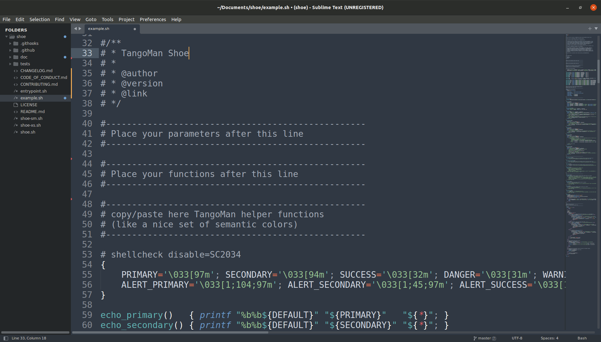
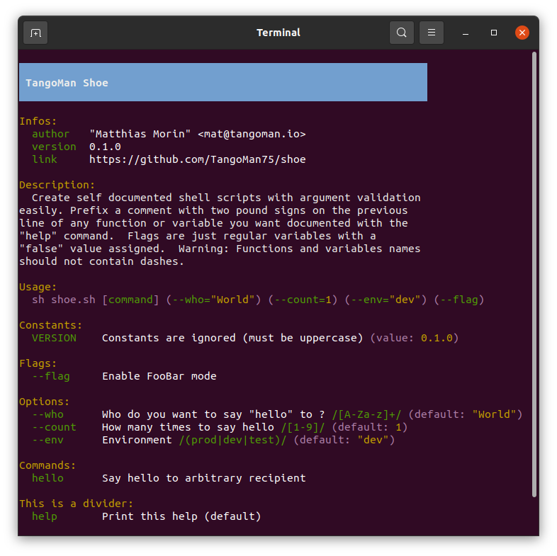
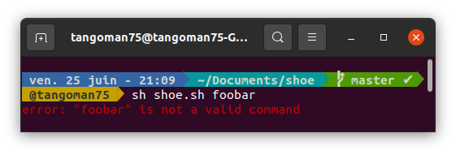
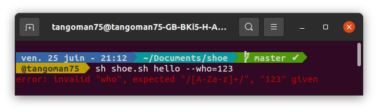

[](https://github.com/TangoMan75/shoe/releases)


👠 TangoMan Shoe Shell Microframework
=====================================

Create self documented shell scripts with argument validation easily. Prefix a comment with two pound signs on the previous line of any function or variable you want documented with the "help" command.



🤔 Why did I create this ?
--------------------------

_Ubuntu_ is fantasctic, I highly recommend it ; But since version 20.04 _GNU Make_ is no longer available by default. Also _GNU Make_ is unavaillable in _Alpine_ nor _Busybox_ based containers either, this is why I started **TangoMan Shoe Shell Microframework** project. ("Shoe" like in "tango shoe"... Get it ?)

**TangoMan Shoe Shell Microframework** is a 100% Posix compatible. I mainly developped "Shoe" to setup CI/CD pipelines fast, but you can use it for whatever else you want. For example **TangoMan Shoe Shell Microframework** makes a great shell script boilerplate.

🎯 Features
-----------

**TangoMan Shoe Shell Microframework** provides the following features:

- ⚡ Self documenting shell scripts.
- ⚡ Functions are automatically converted to commands.
- ⚡ Variables are automatically converted to options.
- ⚡ Global installation script with terminal autocomplete.
- ⚡ Boolean variables are automatically converted to flags.
- ⚡ Runtime parameter validation with regular expressions.
- ⚡ Automatic shorthand for commands, parameters and flags.
- ⚡ Optional command grouping by category in the help section.
- ⚡ 100% POSIX shell compatible (ie: script will run inside most containers).
- ⚡ Codebase is 100% shellcheck validated.
- ⚡ 100% unit test coverage.

📑 Documentation
----------------

Just write your functions in **TangoMan Shoe Shell Microframework** template.

### 📝 Self Documentation

Prefix a comment with two pound signs on the previous line of any function or variable you want documented with the "help" command.

"help" prints commands in the order they appear in the script.

Group your functions by categories by dividing them with a title prefixed with three pound signs.

Change displayed title and description by editing docblock infos at the top of the actual file.

```bash
#/**
# * Script Title
# *
# * Place here script description.
# *
# * @author  "Your Name" <your@email.com>
# * @version 0.1.0
# * @link    https://your.website.com
# */
```

### 🔥 Runnig scripts

Shorthands are available for the first function, flag or variable with a given alphabetial character.

eg:

```bash
$ sh shoe.sh h
# will return the same result as
$ sh shoe.sh hello
```
as long as no other function starts with the letter "h" in the script. In that case only the first one will be executed.

```bash
$ sh shoe.sh hello -f
# is the same as
$ sh shoe.sh hello --foobar
# and
$ sh shoe.sh hello -w TangoMan
# is the same as
$ sh shoe.sh hello --who TangoMan
```

Uppercase variables appear in the "help" but cannot be set from the command line.

Private constants and functions are prefixed with underscore : They do not show up in the "help" and are not available from the command line.

```bash
#--------------------------------------------------
# Place your parameters after this line
#--------------------------------------------------

## Who do you want to say "hello" to ? /[a-zA-Z]+/
who="World"

## How many times to say hello /[1-9]/
count=1

## Enable FooBar mode
flag=false

## Environment /(prod|dev|test)/
env="dev"

## Constants are ignored (must be uppercase)
VERSION=0.3.0

## Private constants (and variables) are prefixed with underscore
_SECRET=this_not_so_secret

#--------------------------------------------------
# Place your functions after this line
#--------------------------------------------------

## Say hello to arbitrary recipient
hello() {
    loop=0
    while [ "${loop}" -lt "${count}" ]; do
        echo "Hello ${who} !"
        loop=$((loop+1))
    done

    if [ "${flag}" = true ]; then
        echo "FOOBAR MODE ENABLED !"
    fi
}

## This is a private function
_version() {
    echo "${env}"
    echo "${VERSION}"
    echo "${_SECRET}"
}
```

The example above will generate this result:



### 🔎 Validation

Unknown command will raise following error:


Unknown option will raise following error:


Illegal argument will raise following error:


### 🍭 Flavors

**TangoMan Shoe Shell Microframework** is available in three versions: Normal, Small and extra small. Each one is optimized for best performance.

#### 🌈 Small Version
_shoe-sm.sh_ is the same as normal version without flags.

#### 🌈 Extra Small Version
_shoe-xs.sh_ is the same as small version without options (and no validation).

### 🐛 Limitations

#### 🐛 Function names

Function names should not not contain dashes.

#### 🐛 Repetition

Function will execute as many times as parameter is given, for example the command below will execute the `hello` function thee times.

```bash
$ sh shoe.sh hello hello hello
```

#### 🐛 Flags

Whereas last flag or option will overwrite variable value.

```bash
$ sh shoe.sh hello --who=foo --who=bar
```
The command above will return :
```
Hello bar !
```

#### 🐛 Validation

Validation regex cannot contain interval syntax.

The following syntax will not work properly :

```
## Local IP address /^[0-9]{1,3}\.[0-9]{1,3}\.[0-9]{1,3}\.[0-9]{1,3}$/
ip=127.0.0.1
```

whereas this one will :

```
## Local IP address /^[0-9]+\.[0-9]+\.[0-9]+\.[0-9]+$/
ip=127.0.0.1
```

💻 Dependencies
---------------

**TangoMan Shoe Shell Microframework** requires the following dependencies:

- Awk
- bash_unit
- Docker
- Sed
- Shell (ash supported)
- Shellcheck

🤝 Contributing
---------------

Thank you for your interrest in contributing to **TangoMan Shoe Shell Microframework**.

Please review the [code of conduct](./CODE_OF_CONDUCT.md) and [contribution guidelines](./CONTRIBUTING.md) before starting to work on any features.

If you want to open an issue, please check first if it was not [reported already](https://github.com/TangoMan75/shoe/issues) before creating a new one.

📜 License
----------

Copyrights (c) 2024 &quot;Matthias Morin&quot; &lt;mat@tangoman.io&gt;

[](LICENSE)
Distributed under the MIT license.

If you like **TangoMan Shoe Shell Microframework** please star, follow or tweet:

[](https://github.com/TangoMan75/shoe/stargazers)
[](https://github.com/TangoMan75)
[](https://twitter.com/intent/tweet?text=Wow:&url=https%3A%2F%2Fgithub.com%2FTangoMan75%2Fshoe)

... And check my other cool projects.

🙏 Acknowledgements
-------------------

- This script was inspired by **Peter Forret** [bashew](https://github.com/pforret/bashew)
- [bash_unit](https://github.com/pgrange/bash_unit): bash unit testing enterprise edition framework (used for CI/CD)
- [shellcheck](https://github.com/koalaman/shellcheck): a static analysis tool for shell scripts (used for CI/CD)
