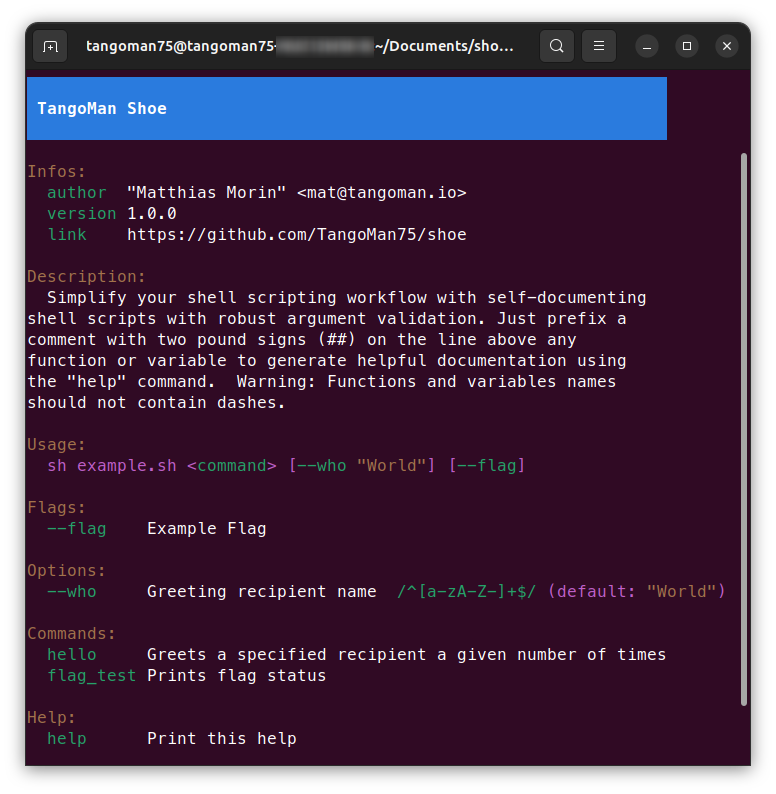
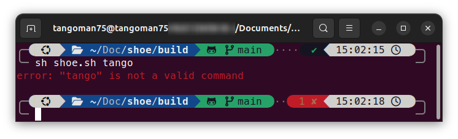
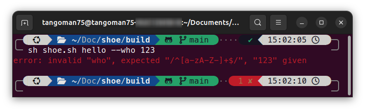

[](https://github.com/TangoMan75/shoe/releases)


👠 TangoMan Shoe Shell Microframework
=====================================

A Lightweight script boilerplate for Posix Systems
--------------------------------------------------

Simplify your shell scripting workflow with self-documenting shell scripts with robust argument validation.
Just prefix a comment with two pound signs (##) on the line above any function or variable to generate helpful documentation using the "help" command.


🎯 Features
-----------

**TangoMan Shoe Shell Microframework** provides the following features:

1. **⚡ Shell Script Boilerplate:**

Use **TangoMan Shoe Shell Microframework** as a starting point for your own _shell scripts_, benefiting from its modular structure and best practices.

2. **⚡ Semantic Output Coloring:**

**TangoMan Shoe Shell Microframework** includes a suite of visually appealing and semantically meaningful color functions.
You can print `primary`, `secondary`, `success`, `danger`, `warning`, `info`, `light` and `dark` text with **indentation** and **padding** in **any** POSIX terminal.

3. **⚡ Easy Annotation:**

**TangoMan Shoe Shell Microframework** provides an intuitive annotation system that enables parameter validation and automatic documentation generation.

4. **⚡ Self-Documenting Shell Scripts:**

Prefix a comment with two pound signs (`##`) on the line above any _function_ or _variable_, the `help` command will generate documentation on the fly.

5. **⚡ Automatic Function-to-Command Conversion:**

Define your _functions_ as usual, they are automatically available as _commands_ at runtime, making your scripting more intuitive.

6. **⚡ Automatic Variable-to-Option Conversion:**

Define your global _variables_ as usual, they are converted as _options_ at runtime.

7. **⚡ Runtime Parameter Validation:**

Append a regular expression (eg: `/^a-zA-Z$/`) at the end of any _option_'s annotation, it will provide automatic validation at runtime.

8. **⚡ Automatic Boolean-to-Flag Conversion:**

Set a global variable to `false`, it creates a _flag_ for simple on/off settings.

9. **⚡ Automatic Shorthand:**

Shorthand for commands, options and flags are automatically created.

10. **⚡ POSIX Shell Compatibility:**

**TangoMan Shoe Shell Microframework** is 100% POSIX compliant, run your scripts in virtually any environment, including containers and android based systems.

11. **⚡ MacOS Compatibility Layer:**

**TangoMan Shoe Shell Microframework** provides optional compatibility functions, since some _shell_ commands syntax can vary between _Mac_ and _Linux_ (eg: `sed`).

12. **⚡ Global Installation With Autocomplete:**

Install and use your custom command across your system, **TangoMan Shoe Shell Microframework** will dump and load the appropriate _comspec_ in your `sh`, `bash` or `zsh` terminal.

13. **⚡ Extract Markdown Documentation Directly From Script Source:**

Automate the generation of comprehensive Markdown documentation from a single source of truth.
**TangoMan Shoe Shell Microframework** extracts information from the script annotations to generate documentation, it will never become outdated !

14. **⚡ Automate Makefile Creation:**

By extracting information from your shell scripts, it automatically generates Makefiles, complete with build rules and help messages.

15. **⚡ Shellcheck Validation:**

**TangoMan Shoe Shell Microframework** codebase is 100% shellcheck validated, it will not trigger any warnings or errors in your CI/CD pipeline.

16. **⚡ Unit Test Coverage:**

**TangoMan Shoe Shell Microframework** codebase is thoroughly covered with _bashunit_ tests, ensuring code quality and reliability.

17. **⚡ Command Grouping:**

Prefix a comment with three pound signs (`###`) to organize related commands into categories for better help output.

18. **⚡ Shoemaker Developement Tool:**

Use `shoemaker.sh` tool to split a script file into its components, build a script from a _"build.shoe"_ file, generate _Makefile_ or _Markdown_ documentation from a shoe script.

19. **⚡ Code Snippets:**

In addition, **TangoMan Shoe Shell Microframework** includes a library of reusable code snippets that cover common use cases, saving you time and effort.

📑 Documentation
----------------

1. Full Shoe documentation can be found here: [./doc/shoe.md](./doc/shoe.md)
2. Documentation for `shoemaker.sh` can be found here: [./doc/shoemaker.md](./doc/shoemaker.md)
3. Documentation for `entrypoint.sh` can be found here: [./doc/entrypoint.md](./doc/entrypoint.md)

### 📝 Annotations

Prefix a comment with two pound signs (##) on the line above any function or variable to generate helpful documentation using the `help` command.

`help` prints commands in the order they appear in the script.

### 📝 Sections

Group commands by categories by dividing them with a comment prefixed with three pound signs (###).

### 📝 Docbloc

Change displayed title and description by editing docblock infos at the top of the actual file.

```bash
## Script Title
##
## Place here script description.
##
## @author  "Your Name" <your@email.com>
## @version 0.1.0
## @license MIT
## @link    https://your.website.com
## @update  https://raw.githubusercontent.com/<USERNAME>/<REPOSITORY>/refs/heads/main/<SCRIPT>.sh
```

🔥 Script Execution
-------------------

### 🔥 Shorthands

**TangoMan Shoe Shell Microframework** allows you to use short versions (shorthands) for functions, flags, or options with a specific alphabetial character.
Only the first occurrence of each letter can be used as a shorthand.
These shorthands work based on the order they appear in the script.

```bash
$ sh shoe.sh h
# will return the same result as
$ sh shoe.sh hello
# but it will NOT execute "help"
```

```bash
$ sh shoe.sh hello -f
# is the same as
$ sh shoe.sh hello --foobar
# and
$ sh shoe.sh hello -w TangoMan
# is the same as
$ sh shoe.sh hello --who TangoMan
```

🔥 Constants
------------

Any uppercase variable is considered a constant withing the framework, they cannot be directly modified from the command line but will be displayed in the `help` output.

🔥 Private Elements
-------------------

Elements prefixed with an underscore are considered private.
This means they are not visible in the `help` output and cannot be accessed or invoked from the command line.

```bash
#--------------------------------------------------
# Place your options after this line
#--------------------------------------------------

## Greeting recipient name /^[a-zA-Z-]+$/
who="World"

#--------------------------------------------------
# Place your flags after this line
#--------------------------------------------------

# (any variable set to "false" will convert to a flag at runtime)
## Example Flag
flag=false

#--------------------------------------------------
# Place your private constants after this line
#--------------------------------------------------

## This constant is private (it will not de displayed in the "help" output)
_PRIVATE="I'm a private constant"

#--------------------------------------------------
# Place your global variables after this line
#--------------------------------------------------

## This variable is private (it will not de displayed in the "help" output)
_global_variable="I'm a global variable"

#--------------------------------------------------
# Place your functions after this line
#--------------------------------------------------

## Greets a specified recipient a given number of times
hello() {
    # the recipient's name is provided with the "--who" option
    # the repetition count is provided with the "--count" option

    loop=0
    while [ "${loop}" -lt "${count}" ]; do
        echo "Hello ${who} !"
        loop=$((loop+1))
    done
}

## Prints flag status
flag_test() {
    if [ "${flag}" = true ]; then
        echo "Flag is on"

        return 0
    fi

    echo "Flag is off"
}

#--------------------------------------------------
# Place your private functions after this line
#--------------------------------------------------

# Private functions are prefixed with underscore, they cannot be called from the command line and will not appear in the help section.
_private() {
    echo "I'm private"
}
```

The example above will generate this result:



🔎 Validation
-------------

### ⚠️ Errors Messages

If you provide an unrecognized command, the script will display an error message like this:


Similarly, an invalid option will trigger an error message:


Illegal arguments will also result in an error message:


🐛 Limitations
--------------

### 🐛 Function names

⚠️ Function names should not not contain dashes.

### 🐛 Repetition

⚠️ Function will execute as many times as parameter is given, for example the command below will execute the `hello` function thee times.

```bash
$ sh shoe.sh hello hello hello
```

### 🐛 Flags

⚠️ Last flag or option will overwrite variable value.

```bash
$ sh shoe.sh hello --who=foo --who=bar
```
The command above will return :
```
Hello bar !
```

🤔 Why not simply use Make ?
----------------------------

While _GNU Make_ is a powerful build tool, it's not primarily designed for general-purpose scripting :

1. Its **specialized syntax** for defining dependencies and build rules can be **less intuitive and flexible** compared to plain _Shell scripting_.
2. Additionally, _GNU Make_ may **not be universally available across all _Linux_ distributions**, particularly in _Android_-based systems or minimal _Docker_ containers like _Alpine_ or _Busybox_.
3. Also, a **lack of dedicated linting and unit testing tools** for _Makefiles_ can hinder code quality and maintainability.
4. Finally _Makefile_'s **parameter handling** approach is inconvenient, often requiring the use of environment variables.

**TangoMan Shoe Shell Microframework** fills this gap by providing a lightweight, Posix-compatible alternative that's easy to set up, lint, test and use.

📚 Coding Conventions
---------------------

### 📜 Style Guide

**TangoMan Shoe Shell Microframework** adheres to the Google Shell Style Guide, promoting consistent and readable scripts.
You can find the guide here: [https://google.github.io/styleguide/shellguide.html](https://google.github.io/styleguide/shellguide.html)

### 🌐 Variable scope

POSIX shell has no variable scope limitations.
To mitigate potential name collisions, variables in kernel use dunder syntax (double underscores).
Ideally, to avoid variable-related issues entirely within Shoe private functions, it's recommended to use positional arguments.
This involves assigning values to positional parameters using the `set` command (eg: `set -- "$1" "$2" "$3"`).

### 🔢 Positional arguments

To maintain a consistent developper experience, required arguments, particularly file paths, should be specified first.
Optional arguments can be added after these.

💻 Dependencies
---------------

**TangoMan Shoe Shell Microframework** requires the following dependencies:

- Awk
- Sed
- Shell (ash supported)
- Docker (dev)
- bash_unit (dev)
- Shellcheck (dev)

🤝 Contributing
---------------

Thank you for your interrest in contributing to **TangoMan Shoe Shell Microframework**.

Please review the [code of conduct](./CODE_OF_CONDUCT.md) and [contribution guidelines](./CONTRIBUTING.md) before starting to work on any features.

If you want to open an issue, please check first if it was not [reported already](https://github.com/TangoMan75/shoe/issues) before creating a new one.

📜 License
----------

Copyrights (c) 2025 &quot;Matthias Morin&quot; &lt;mat@tangoman.io&gt;

[](LICENSE)
Distributed under the MIT license.

If you like **TangoMan Shoe Shell Microframework** please star, follow or tweet:

[](https://github.com/TangoMan75/shoe/stargazers)
[](https://github.com/TangoMan75)
[](https://twitter.com/intent/tweet?text=Wow:&url=https%3A%2F%2Fgithub.com%2FTangoMan75%2Fshoe)

... And check my other cool projects.

🙏 Acknowledgements
-------------------

- This script was inspired by **Peter Forret** [bashew](https://github.com/pforret/bashew)
- [bash_unit](https://github.com/pgrange/bash_unit): bash unit testing enterprise edition framework (used for CI/CD)
- [shellcheck](https://github.com/koalaman/shellcheck): a static analysis tool for shell scripts (used for CI/CD)
